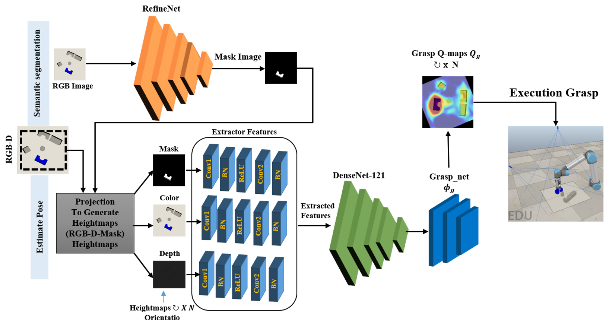
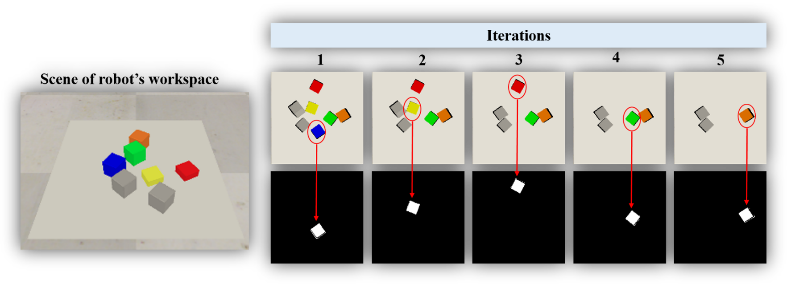

# Color-matching-based-approach-for-robotic-grasping

## Summary:
Object grasping is a basic but difficult task in robotic manipulation due to various object size, shapes and other properties. The problem becomes more challenging when the robot has to reach for and grasp a particular object in cluttered environments. To this end, the color of object can be one of the important features for identifying the target object to be picked up. In this paper, we investigate an approach of training a robot so that it is able to locate the target object by matching its color, and goes on to pick up the object in an unsupervised learning manner. The proposed approach is divided into two parts: 1) a semantic segmentation module that locates the target object by segmenting the color image and creates a mask on the predicted target object, 2) an object pose estimation module that predicts the optimal grasp position of target object based on a deep reinforcement learning framework. The proposed approach was evaluated with various testing scenarios of handling single and multiple colored target objects. The experimental simulation results indicate that the suggested approach achieves an overall success rate of 92% in the grasping task.

Some manufacturing tasks, on the other hand, entail the grasping of a certain object but not all objects. In such a situation, the most efficient and easy way is to infer the target object by detecting the object's color feature. To accomplish this, we suggest a color matching approach for grasping that predicts the target object based on its color. Figure. I illustrates an example depicting the scene that is used in our robot grasp detection strategy.

